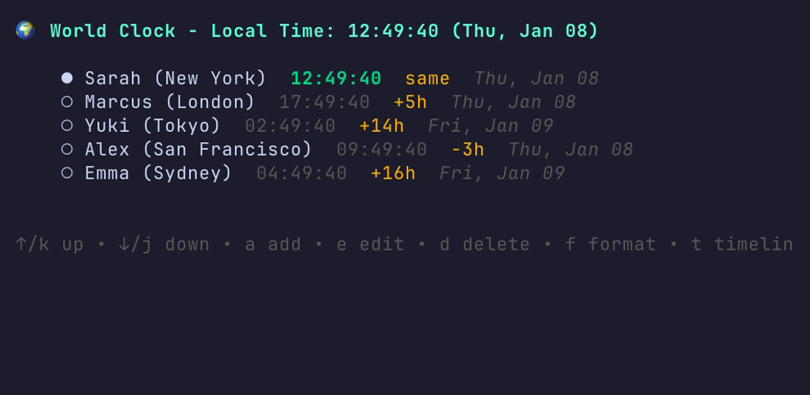
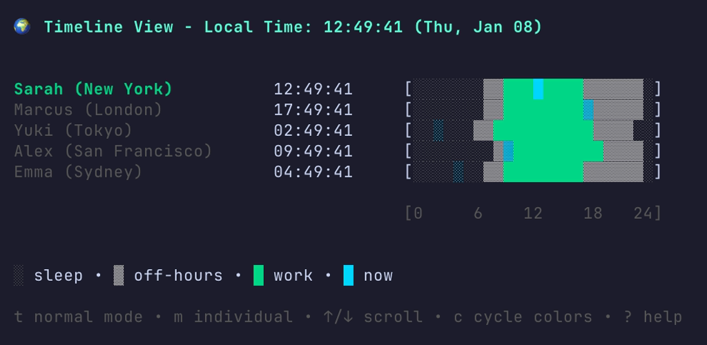
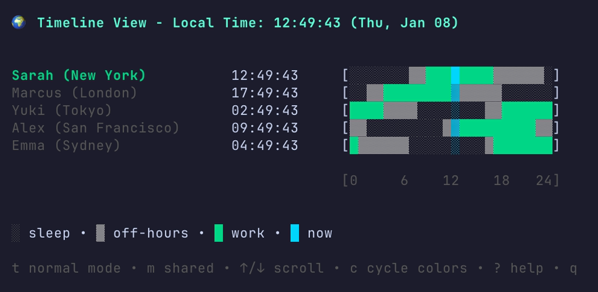

# TUI World Clock

A terminal-based world clock for tracking time across multiple timezones. Perfect for remote teams to know when colleagues are available.


## Screenshots

### Normal Mode


### Timeline View - Individual Mode


### Timeline View - Shared Mode


## Features

- Real-time clocks for multiple timezones
- Time offset display from your local timezone
- Working hours indicator (weekdays vs weekends)
- Toggle between 12h/24h format
- Interactive editing (add/edit/delete colleagues)
- Persistent YAML configuration
- Timeline visualization with two modes
- Five color schemes (classic, dark, high-contrast, nord, solarized)

## Installation

### Prerequisites

- Go 1.21 or later

### Quick Start

```bash
git clone https://github.com/heliostatic/tui-clock.git
cd tui-clock
make build
./tui-clock
```

Or use `make run` to build and run in one step.

### Install to System

```bash
make install
# Binary will be installed to $(go env GOPATH)/bin/tui-clock
```

## Usage

```bash
./tui-clock                              # Use default config
./tui-clock -config /path/to/config.yaml # Use custom config
```

On first run, a default configuration file will be created at `~/.config/tui-clock/config.yaml` with example colleagues.

## Keyboard Controls

### Normal Mode

| Key | Action |
|-----|--------|
| `↑` / `k` | Move cursor up |
| `↓` / `j` | Move cursor down |
| `a` | Add new colleague |
| `e` | Edit selected colleague |
| `d` | Delete selected colleague |
| `f` | Toggle time format (12h/24h) |
| `t` | Enter timeline mode |
| `?` | Show help |
| `q` / `Esc` | Quit |

### Timeline Mode

| Key | Action |
|-----|--------|
| `t` | Return to normal mode |
| `m` | Toggle mode (individual/shared) |
| `c` | Cycle color schemes |
| `↑` / `k` | Scroll up |
| `↓` / `j` | Scroll down |
| `?` | Show help |
| `q` / `Esc` | Quit |

## Timeline Visualization

Press `t` to enter timeline mode and visualize everyone's day at a glance.

**Individual Mode**: Each bar shows 0-24 hours in that person's timezone. The marker shows their current local time.

**Shared Mode**: All bars show 0-24 hours in YOUR timezone. Activities are shifted so you can see who's available at any hour of your day.

### Timeline Legend

- `░` Sleep hours (default: 11pm-7am)
- `▓` Off-hours (awake but not working)
- `█` Work hours (default: 9am-5pm weekdays)
- Highlighted character = current time

### Color Schemes

Press `c` to cycle through color schemes:

- **Classic** - Vibrant true colors for maximum visibility
- **Dark** - Muted colors for low-light environments
- **High Contrast** - Accessibility-focused with ANSI colors
- **Nord** - Nordic-inspired with adaptive light/dark support
- **Solarized** - Adaptive scheme for light/dark terminals

## Configuration

The configuration file uses YAML format:

```yaml
time_format: "24h"           # "12h" or "24h"
color_scheme: "classic"      # classic, dark, high-contrast, nord, solarized
timeline_mode: "individual"  # individual or shared

colleagues:
  - name: "Alice (New York)"
    timezone: "America/New_York"
    work_start: 9     # Optional, default 9
    work_end: 17      # Optional, default 17
    sleep_start: 23   # Optional, default 23
    sleep_end: 7      # Optional, default 7

  - name: "Bob (London)"
    timezone: "Europe/London"
```

### Common Timezones

- **Americas**: `America/New_York`, `America/Los_Angeles`, `America/Chicago`
- **Europe**: `Europe/London`, `Europe/Paris`, `Europe/Berlin`
- **Asia**: `Asia/Tokyo`, `Asia/Shanghai`, `Asia/Singapore`, `Asia/Kolkata`
- **Pacific**: `Australia/Sydney`, `Pacific/Auckland`

See `config.example.yaml` for a full example.

## Development

```bash
make help           # Show all available commands
make build          # Build the binary
make test           # Run tests
make lint           # Run golangci-lint
make screenshots    # Regenerate README screenshots (requires VHS)
```

See [CONTRIBUTING.md](CONTRIBUTING.md) for detailed development guidelines.

## Built With

- [Bubbletea](https://github.com/charmbracelet/bubbletea) - TUI framework
- [Lipgloss](https://github.com/charmbracelet/lipgloss) - Styling and layout
- [Bubbles](https://github.com/charmbracelet/bubbles) - TUI components

## License

MIT
